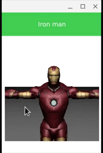

# QML apply a texture to a Mesh

Question:

> I am trying to apply an image texture to a Mesh in QML (Qt 5.6.2). I started from the
> sample "Shadow Map QML" and I want to texture the GroundPlane. Material and Effect
> qml classes are applied to that GroundPlane mesh but I can't see how to apply an
> image texture. In QML, there is TextureImage, ShaderEffect but nothing about how
> they can be applied to a Mesh. Any ideas?
> EDIT: Qt 5.6.2 is not the good version to work with to use Qt3D as the first "fully
> supported release of a stable Qt 3D module" was in Qt 5.7. So, I'll have a look at
> Qt 5.7, maybe 5.8 now! And at first glance, there is some texture propperties for
> the mesh.

Result:

from [here](https://stackoverflow.com/questions/42907586/qml-apply-a-texture-to-a-mesh)
